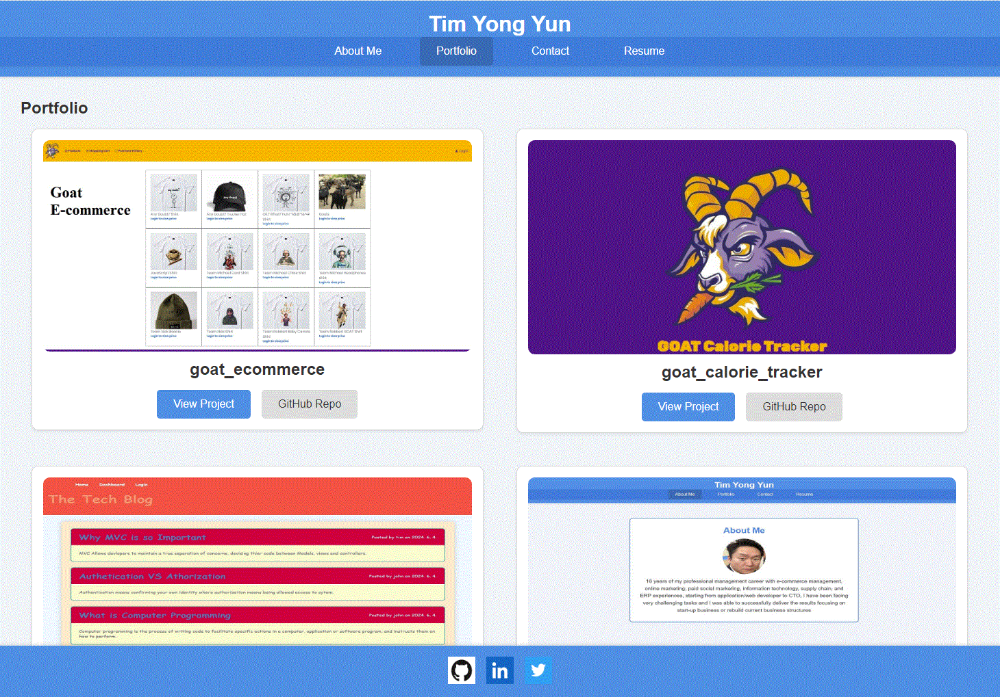
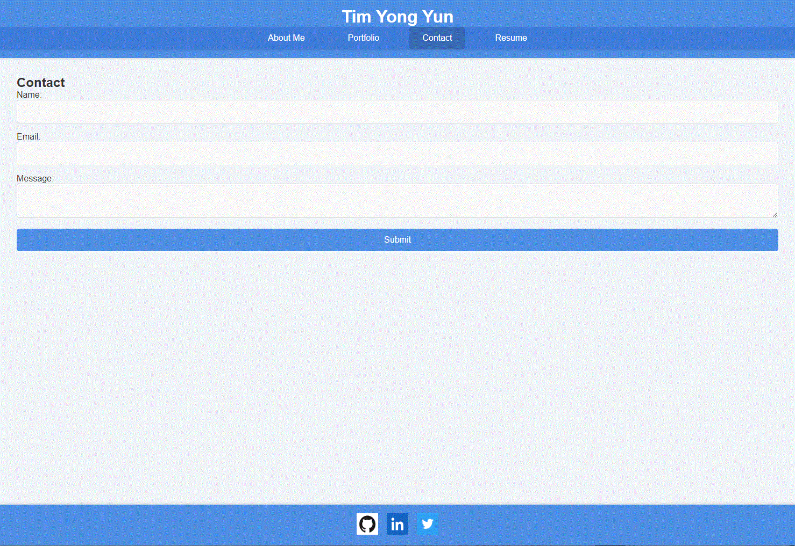
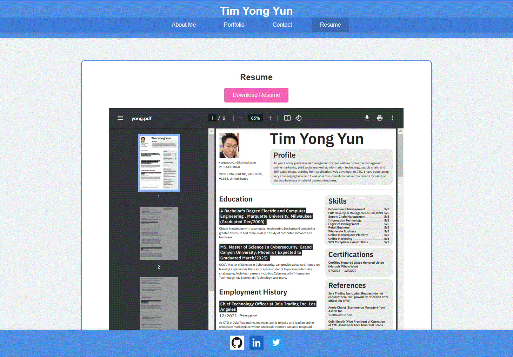

# Portfolio_Using_React
Portfolio_Using_React

Summary of Technologies Used

-React: A JavaScript library for building user interfaces, used to create the single-page application portfolio.
-React Router DOM: A library used for routing in React applications, enabling navigation between different sections of the portfolio.
-Vite: A build tool that provides a faster and leaner development experience for modern web projects, used to build and serve the React application.
-CSS: Cascading Style Sheets used for styling the portfolio, including layout, colors, and hover effects.
-JavaScript: The programming language used to write the React components and handle interactivity.
-HTML: The markup language used to structure the index.html file and the content within the React components.
-ESLint: A tool for identifying and fixing problems in JavaScript code, used to ensure code quality and consistency.
-Node.js and npm: Node.js is a JavaScript runtime used for running the development server, and npm is the package manager used to install dependencies.

Functionality 

Given a single-page application portfolio for a web developer, when I load the portfolio, I see a page with a header, content section, and footer. When I look at the header, I see the developer's name and a menu with links to different parts of the portfolio. When I look at the menu, I see links titled About Me, Portfolio, Contact, and Resume, and the link for the current section is highlighted. When I click on a menu link, the browser URL changes, and I see the related section below the menu with that link highlighted. When I load the portfolio for the first time, the About Me link and section are selected by default. When I look at the About Me section, I see a recent photo or avatar of the developer and a short bio about them. When I look at the Portfolio section, I see titled images of six of the developer’s projects with links to both the live applications and the corresponding GitHub repositories. When I look at the Contact section, I see a contact form with fields for a name, an email address, and a message. When I move my cursor out of one of the form fields without entering text, I get a notification that this field is required. When I enter text into the email address field, I get a notification if I have entered an invalid email address. When I look at the Resume section, I see a link to download the resume and a list of the developer’s skills. When I look at the footer, I see text or icon links to the developer’s GitHub and LinkedIn profiles, and their profile on a third platform (Stack Overflow, Twitter).

